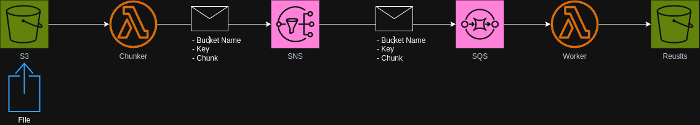

# Distributed File Processor

A scalable serverless solution for processing large files in parallel using AWS Lambda and message queues.

## Architecture



## Overview

This system processes large files by:

1. Breaking them into manageable chunks (Chunker Lambda)
2. Distributing work via SNS/SQS for parallel processing
3. Processing chunks independently (Worker Lambda)
4. Storing results in a dedicated output bucket

## Components

- **Input Bucket**: Receives files for processing
- **Chunker Lambda**: Splits files into processable chunks
- **SNS Topic**: Enables fan-out message distribution
- **SQS Queue**: Buffers work for worker lambdas
- **Worker Lambda**: Processes individual chunks
- **Output Bucket**: Stores processing results

## Features

- ✨ Serverless architecture
- 🚀 Parallel processing
- 📦 Configurable chunk sizes
- 🔒 Secure S3 bucket configurations
- 📝 CloudWatch logging
- ⚡ Event-driven design

## Setup

1. Configure AWS credentials in `.env`

2. Build the Lambda functions:

```bash
./scripts/build.sh
```

3. Deploy the infrastructure:

```bash
terraform init
terraform apply
```

4. Upload a file to the input bucket:

```bash
aws s3 cp test.txt s3://input-bucket-name/test.txt
```

5. Check the output bucket for results:

```bash
aws s3 ls s3://output-bucket-name/
```
